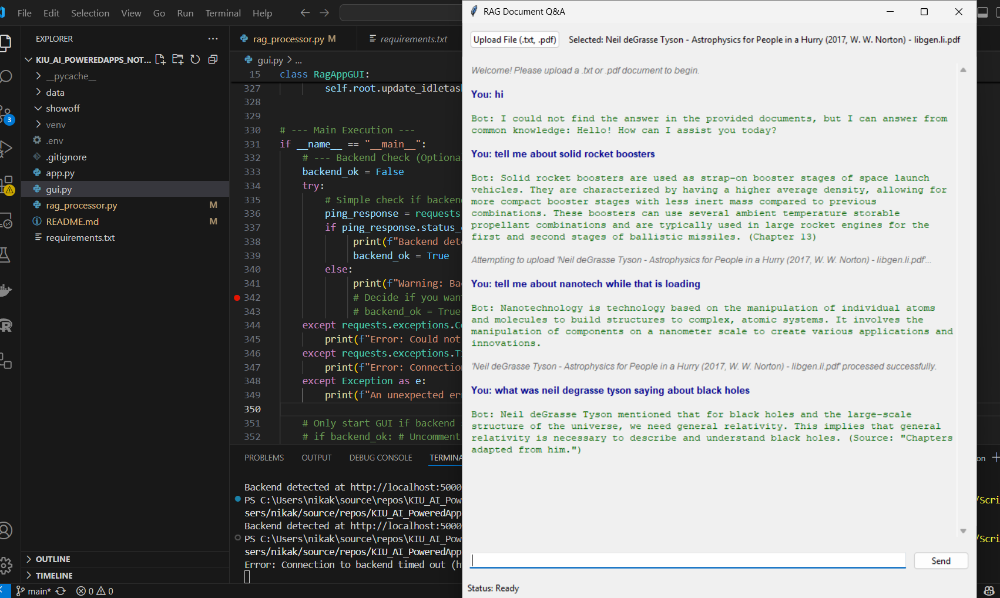

# KIU_AI_PoweredApps_NotebookML_Clone

## app.py

Backend with 3 endpoints:

/heartbeat GET - check that server is alive

/upload POST - upload txt or pdf

/query POST - ask a question

## rag_processor.py

Uses vector store to order and answer prompts from a query

main functions are `add_document` and `answer_query`
Adds basic citation (which part of document mentions answer to query)

## gui.py

Friendly UI that calls this server
